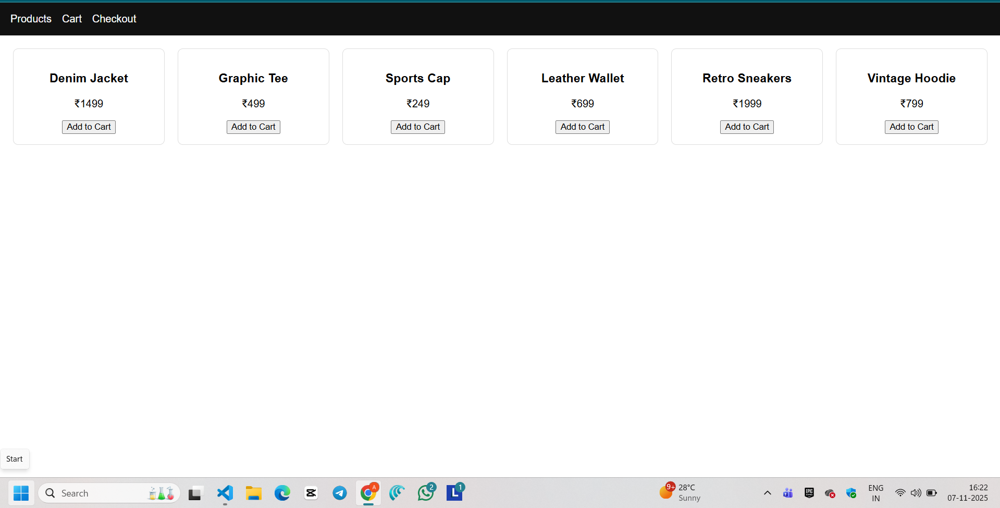
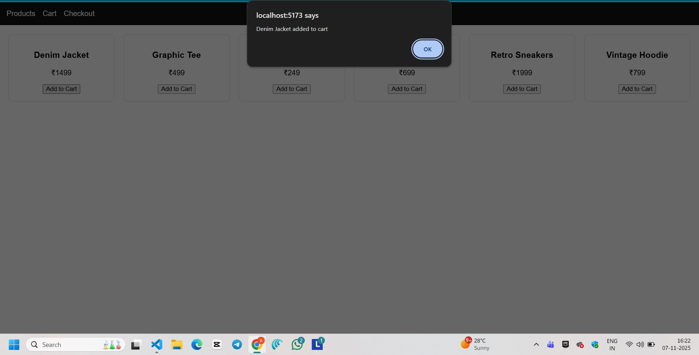
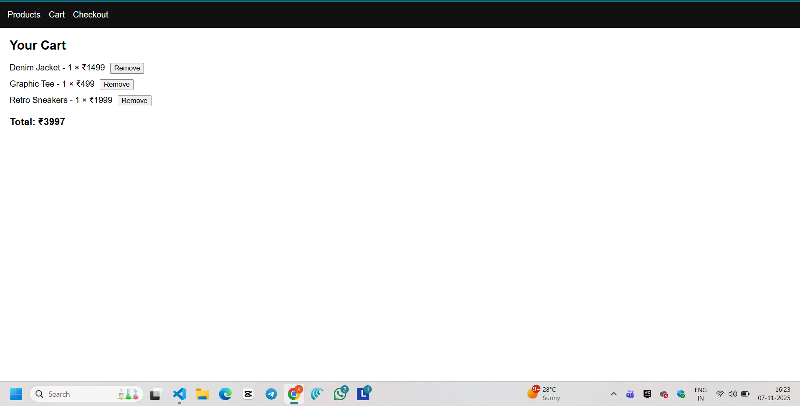
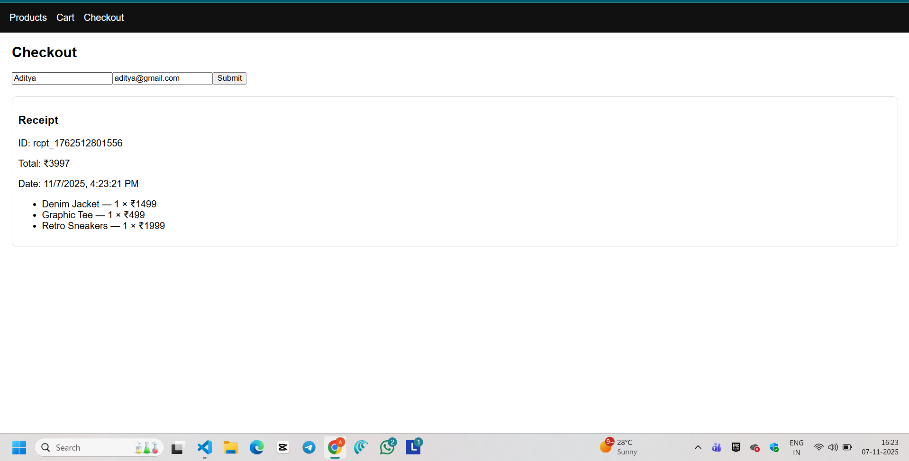

# 🛒 Nexora— Full Stack E-Commerce Mock Cart

### 👨‍💻 Submitted by: Aditya Modanwal

This project is a **full-stack mock e-commerce shopping cart** built as part of the **Vibe Commerce Internship Assignment**.  
It demonstrates complete frontend–backend integration with MongoDB Atlas persistence.

---

## 🚀 Tech Stack
**Frontend:** React (Vite), Axios, React Router  
**Backend:** Node.js, Express, Mongoose  
**Database:** MongoDB Atlas (vibe_cart)

---

## ⚙️ Features
✅ Product grid display  
✅ Add / remove cart items  
✅ Total price calculation  
✅ Checkout form → receipt modal  
✅ MongoDB Atlas persistence  
✅ Responsive UI  

---

---

## 📸 Screenshots & Page Descriptions

### 🏬 1. Products Page
This is the **main product listing page** where all available mock products are fetched from the MongoDB database via the `/api/products` endpoint.  
Each product card displays the name, price, and an **“Add to Cart”** button.  
Users can add any item to their cart with a single click.

---

### 🛒 2. Add to Cart Popup
When a user clicks **“Add to Cart”**, a confirmation popup appears showing that the item has been successfully added to the cart.  
This calls the backend `POST /api/cart` API which stores the product and quantity for the current mock user.

---

### 🧾 3. Cart Page
The **Cart Page** shows all products currently added by the user.  
It displays each item’s name, price, quantity, and a **“Remove”** button.  
The total price at the bottom is dynamically calculated using the `/api/cart` API.  
Users can remove items and instantly see the updated total.

---

### 💳 4. Checkout Page & Receipt
The **Checkout Page** collects the customer’s name and email for a mock purchase.  
When the form is submitted, a **mock receipt** is generated showing:
- Transaction ID  
- Total amount  
- Purchase date/time  
- List of products purchased  

This flow uses the `POST /api/checkout` endpoint and clears the cart after checkout.

## 📂 Folder Structure
